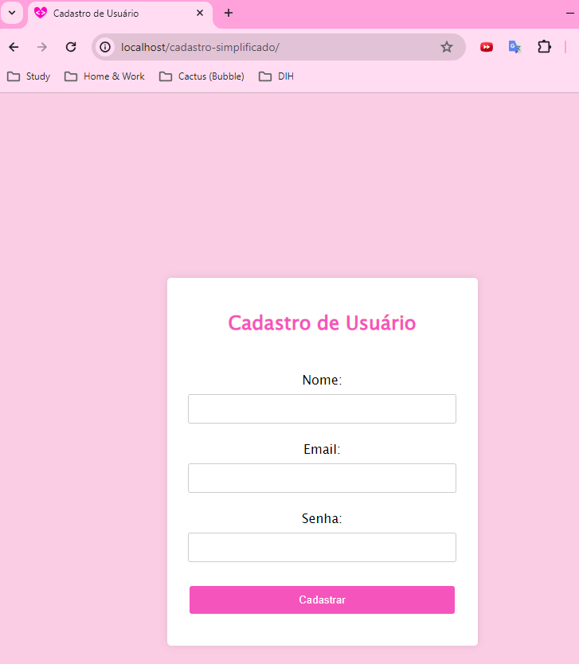

<h1  align="center"> Aula Prática Programação para Internet em Back-End</h1>

 

## Descrição do Projeto

Mini projeto desenvolvido para a disciplina de `Programação para Internet em Back-End`.

  

## Demonstração da Aplicação

 

 
 

https://github.com/danitavareslobo/Anhanguera-AulaPratica-AnaliseDesenvSistemas/assets/107322230/51b970a0-bae3-4f41-90a3-fe651735efc0

 

## Tecnologias Utilizadas
- `PHP`
- `CSS`
- `MySQL`

 

## Autoria do Projeto

| [ Daniele Tavares Lobo](https://github.com/danitavareslobo) |
| :----: |